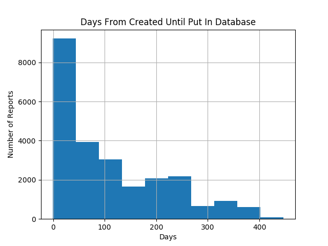
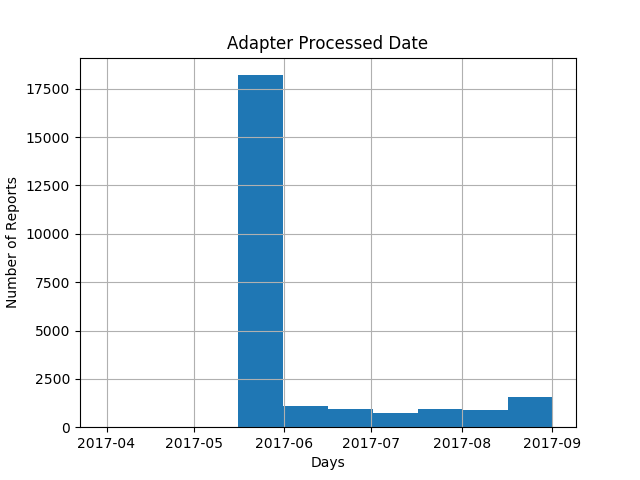
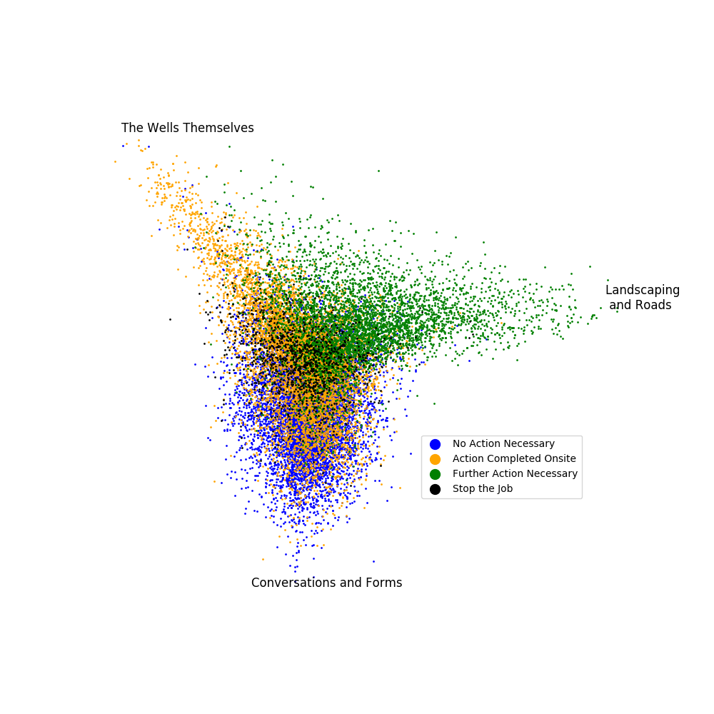

# README #

## Stay Safe, BP ##
* Workers at BP can submit a form from an app on their phone whenever they observe a safety concern.
* More reports come in than can be easily reviewed.
* Some are flagged as important, many more are not.
* I want to prioritize reports for review based on the incident descriptions in the reports.

## For example... ##
Here are two incident descriptions, both taken from reports that were flagged as 'action completed onsite'.
* When opening a gate noticed a large bee on the gate where I was fixing to lay my hand.  Stepped back and waited until bee took off .  Then opened gate.
* Pad went down on low unit pressure when all of the wells were in off cycle.  Re-pressured up equipment and returned pad to service. Cycles need to be reviewed.

No one needs to follow up with the first report, but the second report describes a change in the state of the equipment and recommends an essential action.  Because they are flagged the same way, no one reviewing them would know to look at the second report first.

## The Data  -- Exploratory Data Analysis and Summary Plots ##
### The Dimensions ###
A couple months before I started looking at the safety data, BP started to transition from their old reporting app to a new reporting app, so my first task was to find a way to combine the data received from both apps.  In particular, I wanted to match the form of the new app as much as possible so that the model I created would be most useful in the future.  The data from the old app was arranged into 485 columns while the data from the new app was streamlined into a trim 57 columns.  Of these, 36 columns were carried over from the old app, and my first step was confirming that the content type as well as the column name was the same.  That left 21 columns from the new app that had to be recreated from data in the old app.  Once I successfully combined the data into one table that closely resembled what was received from the new app (I had to drop some columns), I began to look for data that was indicative of importance.

### The Unreliability of Dates ###
There were 16 different date columns in the data.  However, most of these were different parts of the timestamps found in the following six columns:  ['createdDate',
'modifiedDate',
'serverCreatedDate',
'serverModifiedDate',
'eventOccurredDate',
'adapterProcessedDate'].
I thought that perhaps if modifiedDate date was later than createdDate, that would indicate that someone had considered it an important report and followed up with it.  However, the dates in createdDate were completely unreliable, ranging from 1917 to 2018, and often modifiedDate came before createdDate.
I then turned my focus to serverCreatedDate and serverModifiedDate, hoping to remove the error-prone human element.

I could see from these two plots that there weren't going to be enough reports with a delay to train a model, and the bump at 150 days made me wonder about the reliability of even the server times.

The adapterProcessedDate was interesting for its own reasons, as it measured when the report made it to the database.

This was alarming until a conversation with Evan from BP revealed that all the data had been moved to a different database, reseting the adapterProcessedDate for everything that came before.

### The Sparsity of Real Event Types ###
There was a column in both the old safety app format and the new safety app format that listed categories for the events.  As part of my initial investigation, I looked at how many reports of each type were generated at each location over time.

I immediately wondered about the spike at Wamsutter around March, but a conversation with Matt from BP revealed that they had tried a quota system around that time which they discontinued after seeing the quality of the reports this produced.  I also saw that there had been a company-wide shift from identifying reports as 'Hazard Identification' to 'Verification', indicating that neither of these categories was very well defined and that they each served as a default category when none of the well-defined categories seemed appropriate.  Also, reports that listed a type other than these two were exceedingly rare.

While I was initially hopeful that event types would be an essential part of my model, I ended up mostly abandoning it.  If a report lists a meaningful event type, then I will push it to the top of the queue, but these reports are too rare to use for any machine learning model.

### From 485 Columns to 2 ###

The dates weren't the only redundant columns.  There were multiple columns referring to the same location (one would say BPWamsutter while the other would say Wamsutter), and many columns were more granular versions of other columns (Wamsutter is part of Business Unit 'North').  Ultimately only about six columns were were reasonably uncorrelated, and of those six, only two were useful for predictions.

* 'immediateActionsTaken'

Although I did more unsupervised learning than supervised, I would consider this the closest thing I had to a target variable.  The possible values in this column were 'No Action Necessary', 'Action Completed Onsite', 'Further Action Necessary', and 'Stop the Job'.  Reports labeled 'Stop the Job' are considered the most important and reviewed first, followed by 'Further Action Necessary'.  The other two labels, which comprise the vast majority of the reports, are looked at last.

* 'incidentDescription'

This is the free-text field that I focused on for natural language processing.

## Natural Language Processing and Unsupervised Machine Learning ##

I used two techniques to gain insight into the incident descriptions.  The first was term frequency–inverse document frequency (tf-idf) which converts documents to vectors based on what words are used.  The second was singular value decomposition (svd), which identifies dimensions in the word-vector-space where we can see clusters in our comments.

Each point represents an incident description.  The two dimensions shown were identified by the singular value decomposition as principal components of the word-vector-space.  The labels identified in the key were not used to make the decomposition, but it's clear that in these two dimensions, the labels match up with clusters in the incident descriptions.  Reports labeled 'Stop the Job' are at the center, and reports from the other three categories fall near a vector away from the center.  The words around the border are words that are highly positive or highly negative along that dimension.  For example, a description that includes the words 'mowed', 'sprayed', and 'weeds' but not the words 'ball', 'pressure', or 'needle' will fall towards the right of the graph.

Both the top and left have similar words such as 'valve' and 'plug' and 'missing' (there are many reports about missing plugs), so I made a heavily summarized version with only three labels.

In order to check this plot against my intuition, I looked at sample comments from different parts of the plot.

### No Action Necessary ###
When the y value was low (far from the stop-the-job cluster), the comments tend to be accounts of friendly conversations about safety protocol confirming that everyone was doing exactly what they should be doing.  As y increases, the conversations are not quite as friendly, and as points reach the stop-the-job cluster, they are in reaction to people not doing what they should.
### Further Action Necessary ###
When the x value is high (far from the stop-the-job cluster), there are many comments about the roads being washed out or the grass needing to be trimmed so people can avoid snakes.  While any report marked further action necessary should be reviewed, these reports get more important as x gets smaller.  This is because these reports have more to do with the wells.  If they can't complete an action that is within their job description, then it's probably pretty bad.
### Action Completed Onsite ###
There are two opposing thoughts on this.  In one direction, it approaches 'Stop the Job', and in the other direction, it is more likely to be about the wells.  From looking at the comments, comments seem more important nearer the upper left corner.  However, reports labeled Action Completed Onsite need more investigation.

## Another Tactic ##
If a word suddenly starts showing up in reports more frequently than usual, it might indicate a project or problem that has arisen.  I'm considering the z-score of the number of occurrences of each word on a given day relative to the average number of occurrences of that word on the preceding 30 days.  I'm also setting a use threshold of at least 5 to avoid unique or uniquely spelled words, and I'm setting the z-score threshold to 2.5.

For each site, here are the number of abruptly frequent words for each day:

My thinking is that I can prioritize reports if they're representative of the new trend.

I've created a second unrelated score that is a comment's cosine similarity to the mean tfidf vector for that day's comments vs the comment's cosine similarity to the mean tfidf vector for the previous month's comments.  Now I'm exploring how to combine the score generated from the comment's position on the preceding scatter plot and this score.
