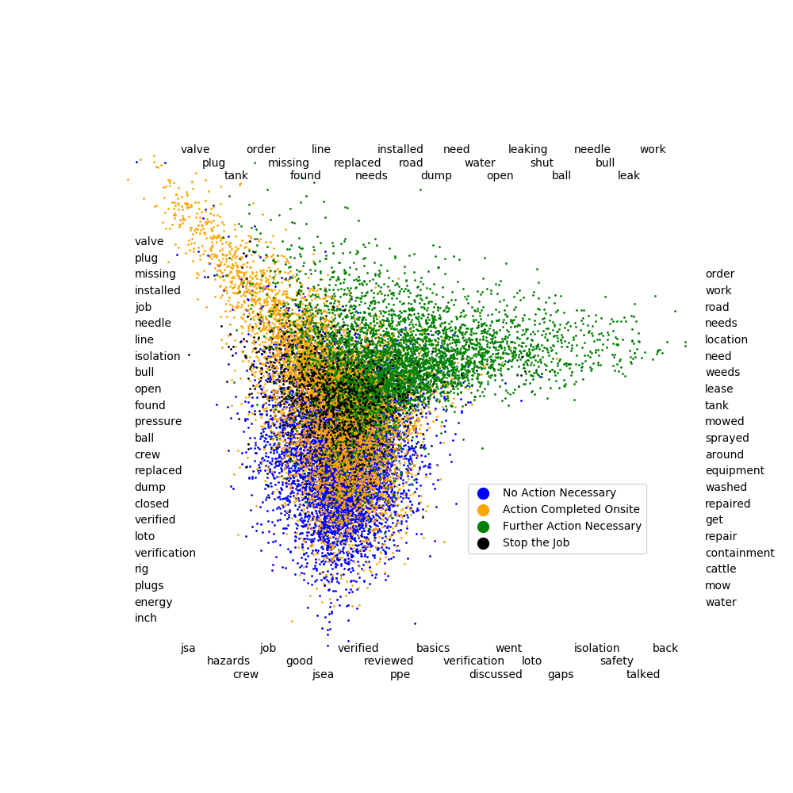
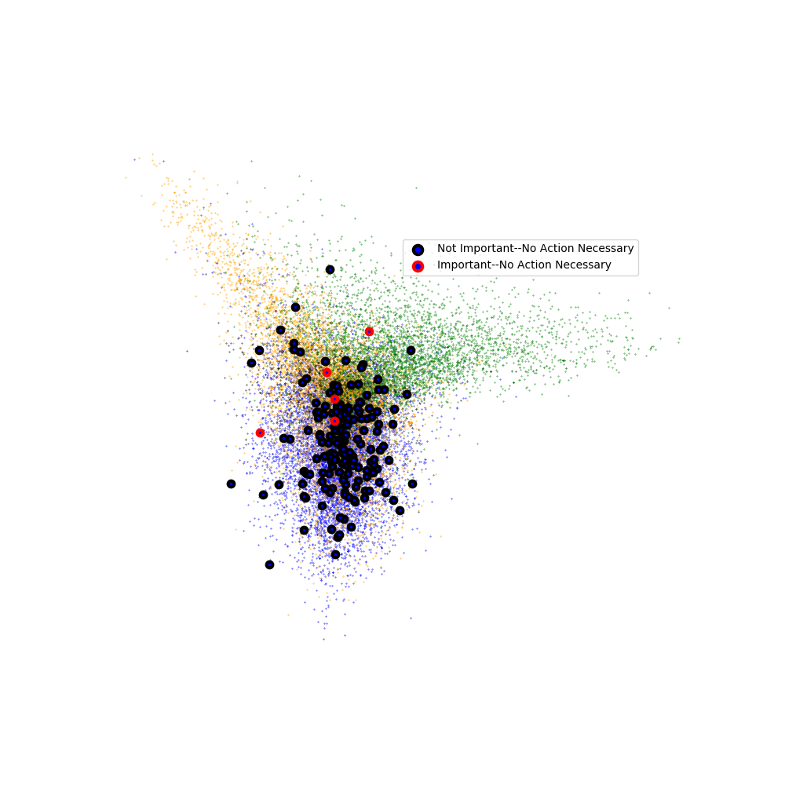

# Stay Safe, BP
## Prioritize Safety Reports for Review

In this project, I examine safety reports submitted by BP workers from sites across the continental United States.  Hundreds of reports come in each day, which is more than can be easily reviewed.  Each of them is flagged as one of the following:
* Stop the Job
* Further Action Necessary
* Action Completed Onsite
* No Action Necessary

This is a great indication of which reports to review first, but most of the reports are flagged as 'No Action Necessary' or 'Action Completed Onsite', and my goal is to prioritize reports within these categories.

## What's included in this repository

The data itself is proprietary so is not included, but I have included multiple python files for cleaning, exploring, and ranking safety reports.

* load_original_data.py
    * I received the safety data in two .csv files with the column names in a third file.  This code reads these files into pandas dataframes and adds the column names.
* combine_data.py
    * The safety reports I received were collected via two systems.  The data collected by the old system arrived in 485 sparse columns, while the data collected by the new system was confined to a mere 57, 36 of which were in common with the old system.  This code transforms data from the old system to match the format from the new system, either by carrying over matching columns or identifying data from the old reports that can be used to fill in the newly introduced columns.
* make_data_numerical.py
    * Most of the columns contained categorical data.  If a column looked like it contained promising data for analysis, I created dummy variables or similar in order to prepare the data for machine learning.
* scorer.py
    * Based on my discoveries, I created a python object that would rank reports from most important to least important.  The next section covers details and limitations of this ranking.
* plots.py
    * All plots in this report were created using matplotlib.

## Incident Descriptions and Natural Language Processing

Out of the hundreds of columns from the original dataset, two became the focus of my investigation:
* immediateActionsTaken:  this was a categorical column that contained one of the four values
    * Stop the Job
    * Further Action Necessary
    * Action Completed Onsite
    * No Action Necessary
* incidentDescription:  this was a free-text field which I used natural language processing tools to explore

Two tools in particular from sklearn were esstential to the success of this endeavor.
* TfidfVectorizer transformed the incident descriptions to normalized vectors based on the words used.
* TruncatedSVD identified dimensions in this vector space that were likely to be illuminating.  The descriptions themselves were too short to use PCA, and trying to do so lead to an error.

Image 1:

I used the TruncatedSVD to look at the incident descriptions in four dimensional space, and the plot above is from two of those dimensions.  The SVD identified these dimensions without reference to the label ('no action necessary', etc.), but when I color coded the points based on label, it was apparent that these labels were separable in this plane.  The words around the edges are those that were most negative or most positive for that component of the SVD, and while they are not immediately interpretable, they did help me to summarize what I was seeing, which I verified by sampling and reading incident descriptions from different locations on the plot.  

Image 2 (a summary of Image 1):

Through sampling and reading descriptions from various segments of this plot, I made the following intuitive determinations:
* The descriptions labeled 'No Action Necessary' get increasingly important the closer they are plotted to the Stop the Job cluster in the center.
* The descriptions labeled 'Further Action Necessary' were also more important the closer they fell to the Stop the Job cluster.  Intuitively this makes sense:  They are not landscapers nor do they repair roads, so if those things need to happen they need to be done by someone else, hence 'Further Action Necessary'.  If they can't complete something related to the wells themselves, which is their job, then it must be pretty bad.
* The descriptions labeled 'Action Completed Onsite' were the most difficult to sort.  On the one hand, it seemed like they would be more important as they got nearer to 'Stop the Job'.  On the other hand, it seemed like they would be more important as they got nearer to the wells themselves.  Since they were primarily located on a vector between the two, this particular perspective was not helpful in ranking them.

## A Small Amount of Test Data
I was fortunate enough to receive some actual test data from BP.  These were randomly selected incident descriptions from reports that had been labeled either 'No Action Necessary' or 'Action Completed Onsite'.  Based on only the description, safety report reviewers from BP marked them as either important or unimportant.

### No Action Necessary

Image 3:

By plotting the test points on the original scatter plot, I confirmed my observations that the important incident descriptions that had been labeled 'No Action Necessary' were those that were close to 'Stop the Job'.  For my ranking system, reports labled 'No Action Necessary' are ranked based on their euclidean distance in these two dimensions from the center (mean) of the stop the job descriptions.

### Action Completed Onsite
As mentioned above, there was no obvious way of interpreting this plot for reports marked 'Action Completed Onsite', and plotting the test points bore this out.

Image 4:

The important and unimportant points have essentially the same distribution.  However, the SVD I'd been using was fitted in four dimensions, and looking at the data from a different perspective was a bit more fruitful for the 'Action Completed Onsite' reports.

Image 5:

From this perspective, 'Action Completed Onsite' descriptions separate into two strands, and the important reports only fall into one of these strands.  The line in the picture is the least squares regression line through 'Stop the Job' reports.  In my report sorter, I rank 'Action Completed Onsite' reports by their orthogonal distance to this line in this plane.

## Conclusion and Utility
I don't advocate using natural language processing as a first resort for sorting reports for review.  Initial sorting should still be based on whether a report is labeled 'Stop the Job', 'Further Action Necessary', 'Action Completed Onsite', or 'No Action Necessary'.  Furthermore, the type of event provides another intuitive way to order reports.  The vast majority of reports have an event type of 'Verification' or 'Hazard Identification', but if they have a type of 'Fire' or 'Injury', they should be at the top of the queue for review.  However, all other things being equal, natural language processing can filter out most of the unimportant 'No Action Necessary' reports and some of the unimportant 'Action Completed Onsite' reports.
